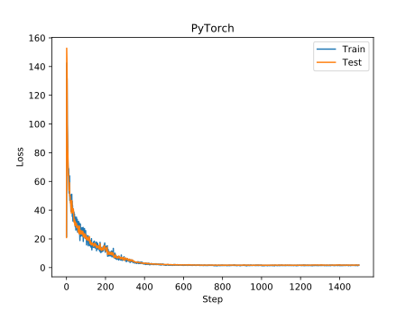

Philip Goto  
11033142

# Assignment 1 - MLPs, CNNs and Backpropagation

## 1 - MLP backprop and NumPy implementation

### 1.1 - Analytical derivation of gradients

$$\begin{aligned}
\widetilde{x}^{(l)} &= W^{(l)} x^{(l-1)} + b^{(l)}\\
x^{(l < N)} &= max(0, \widetilde{x}^{(l)}) + a \cdot min(0, \widetilde{x}^{(l)})\\
x^{(N)} &= \frac{\exp(\widetilde{x}^{(N)})} {\sum \exp(\widetilde{x}^{(N)})}\\
L &= -ln(t^\top x^{(N)})
\end{aligned}$$

#### 1.1 a)

$$\begin{aligned}
\frac {\partial L} {\partial x^{(N)}} &= - \frac{1}{t^\top x^{(N)}} t\\
\frac {\partial x^{(N)}} {\partial \widetilde{x}^{(N)}} &= \frac{1}{\sum\exp(x)} \mathrm{diag}(\exp(x)) - \frac{1}{(\sum\exp(x))^2} \exp(x) \exp(x)^\top\\
\frac {\partial x^{(l<N)}} {\partial \widetilde{x}^{(l<N)}} &= (x \gt 0) + a \cdot (x \le 0)\\
\frac {\partial \widetilde{x}^{(l)}} {\partial x^{(l-1)}} &= W^{(L)}\\
\frac {\partial \widetilde{x}^{(l)}} {\partial W} &= x^{(l-1) \top} \otimes \mathbb{I}_{(d_l \times d_l)}\\
\frac {\partial \widetilde{x}^{(l)}} {\partial b} &= \mathbb{I}_{(d_l \times d_l)}
\end{aligned}$$

#### 1.1 b)

$$\begin{aligned}
\frac {\partial L} {\partial \widetilde{x}^{(N)}} &= \left( - \frac{1}{t^\top x^{(N)}} t \right) \left( \frac{1}{\sum\exp(x)} \mathrm{diag}(\exp(x)) - \frac{1}{(\sum\exp(x))^2} \exp(x) \exp(x)^\top \right)
\end{aligned}$$

### 1.1 - NumPy implementation

...

## PyTorch MLP

